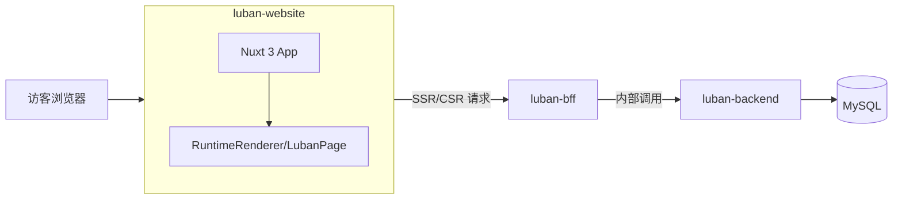

# luban-website 设计

## 1. 定位与目标

- **角色**：对外提供网页服务的应用，面向终端访客（非管理后台）。
- **能力**：根据 URL 从 BFF 获取页面数据（含低代码 schema），用 luban-ui 的 Render 运行时渲染页面与低代码组件。
- **技术栈**：Nuxt 3 + Vue 3 + TypeScript；接入 `luban-low-code` 的 Render（`RuntimeRenderer` / `LubanPage`），数据来自 BFF。

## 2. 与周边系统关系



- **luban-website**：负责路由、从 BFF 拉取页面数据、将 `PageSchema` 传给 Render 做渲染；不直接访问后端或数据库。
- **luban-bff**：需为「对外站点」提供**公开接口**（无需登录），按站点标识 + 路径返回已发布页面的 schema（见下节）。
- **luban-ui**：通过 npm 依赖 `luban-low-code`（及间接依赖 `luban-base`），仅使用运行时渲染能力，不使用设计器。

## 3. 数据流：从 BFF 到 Render

1. 访客打开某 URL（如 `/{path}` 或 `/{siteSlug}/{path}`）。
2. Nuxt 在服务端或客户端调用 BFF 的**公开接口**，入参为站点标识（如 `slug`）与路径（如 `path`）。
3. BFF 返回该路径下**已发布**页面的数据，至少包含：`schema: PageSchema`（含 `root`、可选 `formState`）。
4. 将 `schema` 传给 `LubanPage` 或 `RuntimeRenderer`，由 luban-low-code 根据 schema 渲染低代码组件树。

**BFF 公开接口约定（需在 BFF 侧实现或已有）**：

- 示例：`GET /api/public/sites/:slug/pages/by-path?path=/home`
- 或：`GET /api/public/pages?site=:slug&path=:path`
- 响应：仅返回 `status === 'published'` 的页面；Body 含 `schema`（与 [luban-backend docs/API.md](https://github.com/your-org/luban-backend/blob/main/docs/API.md) 中 Page.schema 一致，即 `PageSchema`）。
- **无需鉴权**：供对外站点使用，不携带 JWT。

若当前 BFF 尚无上述公开接口，需在 BFF 与后端（luban-backend）增加「按站点 + 路径查询已发布页面」的接口，并在本设计中以该约定为准。

## 4. 技术选型与约束

| 项目       | 选型说明 |
| ---------- | -------- |
| 框架       | Nuxt 3（Vue 3，支持 SSR） |
| 语言       | TypeScript |
| 渲染       | luban-low-code 的 `RuntimeRenderer` 或 `LubanPage`，接收 `PageSchema` |
| 数据获取   | 从 BFF 获取页面数据（`useFetch` / `useAsyncData`，服务端优先） |
| 依赖       | npm 包 `luban-low-code`（其依赖 `luban-base` 会一并引入） |

- 组件风格与能力以 **luban-ui**（luban-base + luban-low-code）为准，不在此应用中重复实现业务组件。
- 使用 **TS** 编写应用代码与类型定义，BFF 返回的 `PageSchema` 与 luban-low-code 导出的类型一致。

## 5. 项目结构建议

```
luban-website/
├── app.vue
├── nuxt.config.ts
├── package.json
├── tsconfig.json
├── docs/
│   └── DESIGN.md          # 本设计文档
├── server/                # 可选：Nuxt server API 代理/转发
├── public/
├── router/                # 路由配置（SPA 风格）：routes.ts 中配置 path + 懒加载 component，resolveRoute(path) 解析当前 URL
├── views/                 # 由 router 引用的页面组件（Home.vue、DynamicPage.vue 等）
└── pages/
    └── [[...all]].vue     # 唯一 Nuxt 页面：根据 path 调用 resolveRoute，渲染对应 view 组件
```

- **类型**：在 `types/` 或同目录下定义与 BFF 契约一致的 TS 类型（如 `PageSchema` 可从 `luban-low-code` 直接导入，页面数据接口 `PagePayload` 等自行定义）。
- **组合式函数**：如 `usePageByPath(siteSlug, path)` 内部使用 `useFetch`/`useAsyncData` 调 BFF 公开接口，返回 `{ data, error, pending }`，供页面组件使用。

## 6. 核心实现要点

### 6.1 依赖

- `nuxt`（^3.x）
- `vue`（^3.x）
- `luban-low-code`：渲染用（需已发布到 npm 或通过 workspace 引用）
- `luban-base`：若未作为 luban-low-code 的依赖被正确拉取，可显式声明

### 6.2 运行时渲染

- 从 BFF 拿到当前页的 `schema`（`PageSchema`）。
- 使用 `<LubanPage :schema="schema" />` 或直接使用 `<RuntimeRenderer :root="schema.root" :form-state="schema.formState" />`。
- 若 Nuxt SSR 下对部分组件存在 hydration 问题，可对包含 Render 的块使用 `<ClientOnly>` 包裹（按需）。

### 6.3 路由与数据

- **单站点**：可配置一个默认 `siteSlug`（环境变量或 nuxt.config），路由形态为 `/:path`，请求 BFF 时固定带上该 slug。
- **多站点**：路由形态可为 `/:site/...path`，`site` 作为 BFF 的站点标识（如 slug）。
- 404：BFF 无数据或返回 404 时，展示 Nuxt 的 error 或自定义 404 页。

### 6.4 环境与配置

- **BFF 基地址**：通过 `runtimeConfig.public.bffBaseUrl` 或环境变量配置，请求公开接口时拼接到路径前（如 `https://bff.example.com`）。
- **默认站点**：若单站点，可配置 `runtimeConfig.public.defaultSiteSlug`。

## 7. 与 luban-ui Render 的对接

- **类型**：`PageSchema`、`NodeSchema` 从 `luban-low-code` 包导入，与 BFF/后端约定一致。
- **组件**：仅使用运行时能力，例如：
  - `import { LubanPage } from 'luban-low-code'`，传入 `schema`；
  - 或 `import { RuntimeRenderer } from 'luban-low-code'`，传入 `root` + `formState`。
- 不引入设计器（LubanDesigner）及与拖拽相关的逻辑。

## 8. 后续可扩展

- SEO：利用 Nuxt SSR 输出页面 HTML，便于爬虫与 SEO。
- 多站点/多主题：按站点 slug 切换 layout 或主题变量。
- 缓存：对 BFF 的页面接口做短期缓存（Nuxt 层或 BFF 层），减少后端压力。
- 错误与降级：BFF 超时或 schema 异常时，展示友好错误页或静态兜底内容。

本设计确保 luban-website 作为「对外网页应用」仅负责路由、拉取 BFF 数据与渲染；所有业务数据与 schema 来自 BFF，渲染能力来自 luban-ui 的 Render（luban-low-code），技术栈为 Nuxt 3 + Vue 3 + TypeScript。
