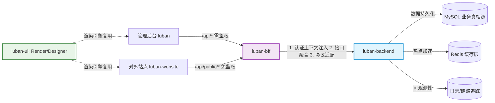

# 从零搭建企业级低代码平台全栈开发指南

+++
title = '从零搭建企业级低代码平台全栈开发指南'
date = 2026-03-17T09:00:00+08:00
tags = ['低代码', '全栈', 'Nuxt', 'Vue3', 'Spring Boot', 'MyBatis', 'Redis', 'MySQL', 'BFF', '组件库', '企业级架构', '可扩展性']
categories = ['工程实践', '架构设计']
draft = false
+++

本文以「鲁班低代码平台」为例，从系统架构师视角给出可落地、可演进的企业级低代码平台全栈架构与实现路线，覆盖组件库、设计器、接入层、主后端及交付形态，兼顾提效、稳定、可扩展与可治理能力。

## 1. 架构核心：六库分工，领域驱动+分层解耦

鲁班平台基于低代码核心领域边界拆分仓库，核心分工如下：

|仓库名称|核心定位|领域边界|核心价值|
|---|---|---|---|
|`luban-ui`|前端核心能力层|组件体系 + 设计器 + 运行时渲染|统一渲染引擎，组件标准化降低扩展成本|
|`luban-backend`|核心领域服务（主后端）|站点/页面/用户/系统配置的领域逻辑|承载业务真相源与企业级治理能力|
|`luban-backend-go`|多语言运行时（可选）|与主后端保持契约一致|应对高并发场景，避免单一语言绑定|
|`luban-bff`|前端接入层（Backend For Frontend）|接口聚合/认证/协议适配|隔离后端变更，收敛接入策略|
|`luban`|运营管理后台|低代码平台的生产运营能力|面向运营/开发人员的操作面，不侵入核心领域逻辑|
|`luban-website`|对外交付站点（Nuxt 3 SSR）|页面渲染 + 前端路由|低代码平台最终交付形态，聚焦用户体验与 SEO|
### 1.1 架构调用链路

**架构核心收益**：

- 稳定层（后端）与变化层（前端/接入层）分离，独立迭代

- 契约驱动降低跨团队协作成本

- 技术栈解耦，各仓库按需选择技术体系

## 2. 数据模型：面向低代码特性的领域建模

### 2.1 核心模型设计

|模型名称|核心字段|企业级设计约束|
|---|---|---|
|Site（站点）|`id(UUID) / name / slug(全局唯一) / baseUrl / status / creator / createdAt`|`slug` 全局唯一；`creator` 关联用户（审计溯源）|
|Page（页面）|`id(UUID) / siteId / name / path(站点内唯一) / status / schema(JSON) / publishTime / operator`|`schema` 版本化存储；`operator` 记录操作人（审计）|
|User（用户）|`id(UUID) / username / name / role / status / password(bcrypt) / lastLoginTime`|角色预留 RBAC 扩展；`lastLoginTime` 用于安全审计|
|SystemSettings|`id / key(唯一) / value(JSON) / updateTime / operator`|按功能模块拆分配置，避免单一 JSON 臃肿|
### 2.2 关键设计原则

- 主键采用 UUID，适配分布式部署与多系统集成

- schema 用 JSON 存储，兼顾灵活性与结构化优势

- 所有核心模型增加审计字段，满足合规要求

- 标准化状态机，定义明确的状态流转规则

## 3. 主后端：luban-backend（企业级领域服务）

### 3.1 技术栈选择：Spring Boot（Java）

核心原因：

- 收敛领域逻辑，承载权限、审计、限流等企业级治理能力

- Java 生态成熟，适配企业后端团队技术栈

- 快速落地可观测性（监控、链路追踪、告警）

### 3.2 技术栈落地最佳实践

|技术组件|用途|企业级优化建议|
|---|---|---|
|MySQL|业务真相源|按 `siteId` 预留分库分表；开启慢查询日志监控|
|Redis|缓存 + 分布式锁|系统配置 TTL 1小时+主动更新；页面缓存 TTL 5分钟+发布失效；分布式锁控制并发发布|
|Spring Boot|核心框架|按领域拆分模块；统一异常处理（返回码+错误信息标准化）|
|MyBatis|ORM 框架|使用 MyBatis-Plus 简化 CRUD；Mapper 按领域拆分|
|Spring Security|权限基础|预留 RBAC 扩展；密码 BCrypt 加密；token 校验下沉到拦截器|
### 3.3 认证与授权：分层治理

- BFF 层：校验登录态，注入用户/租户上下文，接口限流

- 后端层：基于上下文做角色+资源双重授权（如“仅站点创建者可编辑该站点下的页面”）

- 数据层：Mapper 查询时自动拼接 `siteId`/`userId` 条件，避免越权查询

### 3.4 API 契约：权威化、自动化

- 以 `luban-backend/docs/API.md` 为唯一契约源，包含「接口路径+参数+返回值+异常码+权限要求」

- 通过 Swagger/OpenAPI 生成文档，结合 Postman/Newman 做契约测试（BFF/前端必须对齐文档）

- 接口路径增加版本号（如 `/backend/v1/sites`），避免接口变更影响存量业务

## 4. 接入层：luban-bff（前端统一网关）

### 4.1 核心职责（按优先级排序）

1. 接口聚合：把后端多个原子接口聚合为前端“一站式”接口，减少前端请求数

2. 认证与上下文传递：收敛所有登录态校验逻辑，统一向后端注入用户/租户上下文

3. 协议适配：处理跨域、HTTP/HTTPS 转换、JSON/Protobuf 适配（如需）

4. 容错与降级：对接后端接口增加超时重试、熔断降级（如页面缓存失效时直接查数据库，而非返回500）

5. 对外接口管控：`/api/public/*` 接口增加 IP 白名单、QPS 限流，防止恶意访问

### 4.2 公开接口安全边界

- 仅返回 `status=published` 的页面，且过滤敏感字段（如操作人、创建时间）

- 接口返回数据做缓存（Redis），TTL 5分钟，降低后端压力

- 禁止通过 `public` 接口修改数据（仅开放 GET 方法）

## 5. 前端核心：luban-ui（低代码引擎层）

### 5.1 三层组件体系

基础组件（原子层）→ 低代码组件（组合层）→ 业务组件（扩展层）

- 基础/低代码组件：内置，统一设计语言与规范

- 业务组件：预留扩展入口，支持企业自定义

### 5.2 运行时渲染

- 渲染引擎与设计器解耦，对外站点仅加载轻量引擎，减少包体积 70%+

- 定义统一 PageSchema 协议，支持版本升级

- 性能优化：按需加载组件、虚拟列表，应对复杂页面（100+组件）的渲染卡顿

### 5.3 工程化约束

- 组件必须生成 TS 类型声明

- 组件测试覆盖率≥80%（单测 + e2e）

- 发布前做性能检测（包体积、渲染耗时）

## 6. 交付层：管理后台 + 对外站点

### 6.1 管理后台（luban）

核心能力：

- 可视化设计器：拖拽式组件编排、实时预览、一键发布

- 站点级精细化权限：如某用户仅能管理指定站点

- 操作审计：记录所有关键操作，支持溯源

- 批量操作：站点/页面的批量导入导出、批量发布

### 6.2 对外站点（luban-website）

Nuxt 3 SSR 核心优势：

- SEO 友好：适配C端页面需求

- 首屏性能：服务端渲染完成核心内容，首屏加载时间降低 50%+

- 多端适配：可快速扩展为小程序、APP 等交付形态

## 7. 企业级工程化：测试、发布、演进

### 7.1 测试策略

|层级|测试类型|核心覆盖点|
|---|---|---|
|后端|单元测试 + 接口测试|领域逻辑、权限校验、异常场景、缓存一致性|
|BFF|契约测试 + 集成测试|聚合逻辑、降级策略、上下文传递正确性|
|UI|组件单测 + e2e 测试|组件渲染、设计器交互、schema 解析|
|全链路|端到端测试|发布页面 → 访问页面闭环|
### 7.2 发布策略

- 分层发布：先发布后端 → 再发布 BFF → 最后发布前端

- 灰度发布：对外站点支持按 `siteSlug` 灰度（如仅 10% 流量访问新版本）

- 版本回滚：页面 schema 保留历史版本，发布异常可一键回滚到上一版本

### 7.3 演进路线

|阶段|核心目标|关键能力|
|---|---|---|
|MVP|跑通核心闭环|站点+页面+设计器+发布+对外访问；单租户；基础权限|
|2.0|企业级提效|组件市场、RBAC 细粒度权限、审计日志、批量操作、页面模板|
|3.0|高可用+规模化|多租户隔离、灰度发布、CDN 加速、分库分表、多区域部署|
|4.0|生态扩展|第三方系统集成、自定义插件、开放平台 API、数据大屏/报表|
## 8. 架构小结

企业级低代码平台核心设计思想：

1. 按领域分层拆分，每层聚焦核心职责

2. 契约先行，上下游对齐后端 API 契约

3. 稳定与变化分离，核心逻辑稳定，前端快速迭代

4. 渐进式演进，先落地 MVP，再叠加企业级能力

低代码平台的终极价值，是让业务人员“用可视化方式复用企业级架构能力”，而非从零搭建每个页面。
> （注：文档部分内容可能由 AI 生成）
